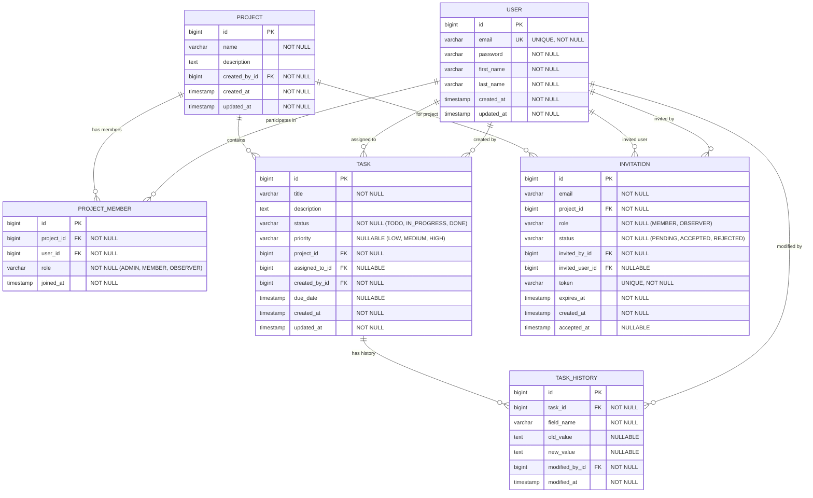

# PMT - Database Schema Design

## Entity Relationship Diagram (ERD)

## Tables Description

### 1. **USER**
Stores all users of the system.
- `id`: Primary key
- `email`: Unique email for login
- `password`: Hashed password
- `first_name`, `last_name`: User's name
- `created_at`, `updated_at`: Audit timestamps

### 2. **PROJECT**
Stores projects created by users.
- `id`: Primary key
- `name`: Project name
- `description`: Optional project description
- `created_by_id`: Foreign key to USER (project creator)
- `created_at`, `updated_at`: Audit timestamps

### 3. **PROJECT_MEMBER**
Junction table for many-to-many relationship between USER and PROJECT.
- `id`: Primary key
- `project_id`: Foreign key to PROJECT
- `user_id`: Foreign key to USER
- `role`: Enum (ADMIN, MEMBER, OBSERVER)
- `joined_at`: When the user joined the project
- **Unique constraint**: (project_id, user_id)

### 4. **TASK**
Stores tasks within projects.
- `id`: Primary key
- `title`: Task title
- `description`: Task description
- `status`: Enum (TODO, IN_PROGRESS, DONE)
- `priority`: Enum (LOW, MEDIUM, HIGH) - nullable
- `project_id`: Foreign key to PROJECT
- `assigned_to_id`: Foreign key to USER (nullable)
- `created_by_id`: Foreign key to USER
- `due_date`: Optional deadline
- `created_at`, `updated_at`: Audit timestamps

### 5. **TASK_HISTORY**
Audit log for all task modifications.
- `id`: Primary key
- `task_id`: Foreign key to TASK
- `field_name`: Name of the field changed (e.g., "status", "assigned_to")
- `old_value`: Previous value
- `new_value`: New value
- `modified_by_id`: Foreign key to USER
- `modified_at`: Timestamp of modification

### 6. **INVITATION**
Stores project invitations sent via email.
- `id`: Primary key
- `email`: Email address of invitee
- `project_id`: Foreign key to PROJECT
- `role`: Role for the invited user (MEMBER, OBSERVER)
- `status`: Enum (PENDING, ACCEPTED, REJECTED)
- `invited_by_id`: Foreign key to USER (who sent the invitation)
- `invited_user_id`: Foreign key to USER (nullable, populated when invitation is accepted)
- `token`: Unique token for invitation link
- `expires_at`: Expiration date (e.g., 7 days from creation)
- `created_at`, `accepted_at`: Timestamps

## Relationships

1. **USER ↔ PROJECT** (Many-to-Many via PROJECT_MEMBER)
   - A user can be a member of multiple projects
   - A project can have multiple members
   - Each membership has a specific role

2. **PROJECT → TASK** (One-to-Many)
   - A project contains multiple tasks
   - Each task belongs to exactly one project

3. **USER → TASK** (One-to-Many for creation and assignment)
   - A user can create multiple tasks
   - A user can be assigned multiple tasks
   - A task can be assigned to zero or one user

4. **TASK → TASK_HISTORY** (One-to-Many)
   - Each task modification creates a history entry
   - Complete audit trail for compliance

5. **PROJECT → INVITATION** (One-to-Many)
   - A project can have multiple pending invitations
   - Each invitation is for one project

## Indexes

Performance optimization indexes:
- `idx_project_member_project_user` on `project_member(project_id, user_id)`
- `idx_task_project` on `task(project_id)`
- `idx_task_assigned` on `task(assigned_to_id)`
- `idx_task_history_task` on `task_history(task_id)`
- `idx_invitation_token` on `invitation(token)`
- `idx_invitation_email_project` on `invitation(email, project_id)`

## Constraints

- **Unique Constraints**:
  - `user.email` (unique)
  - `invitation.token` (unique)
  - `(project_member.project_id, project_member.user_id)` (composite unique)

- **Foreign Key Constraints**:
  - All foreign keys have ON DELETE CASCADE or ON DELETE SET NULL depending on business logic
  - Task assignment: ON DELETE SET NULL (task remains if user deleted)
  - Task creation: ON DELETE CASCADE (task deleted if creator deleted)
  - Project membership: ON DELETE CASCADE (membership removed if user or project deleted)

## Business Rules

1. **Role Hierarchy**: 
   - ADMIN: Full control (CRUD projects, manage members, all task operations)
   - MEMBER: Can create/edit/assign tasks
   - OBSERVER: Read-only access

2. **Task Assignment**:
   - Only project members can be assigned tasks
   - Notification email sent on task assignment

3. **Invitation Flow**:
   - Invitation expires after 7 days
   - Once accepted, creates PROJECT_MEMBER entry
   - Email must match existing user OR new user registration

4. **Audit Trail**:
   - All task changes logged in TASK_HISTORY
   - Includes: status changes, assignment changes, title/description edits

5. **Dashboard**:
   - Tasks grouped by status (TODO, IN_PROGRESS, DONE)
   - Filterable by project, assignee, priority
